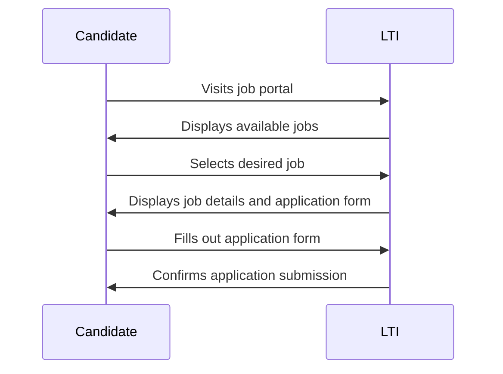
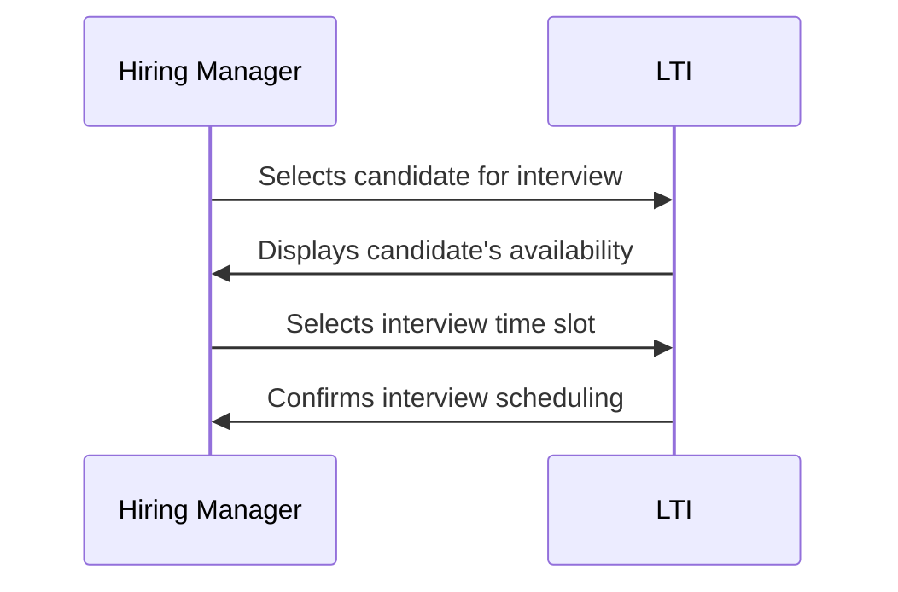
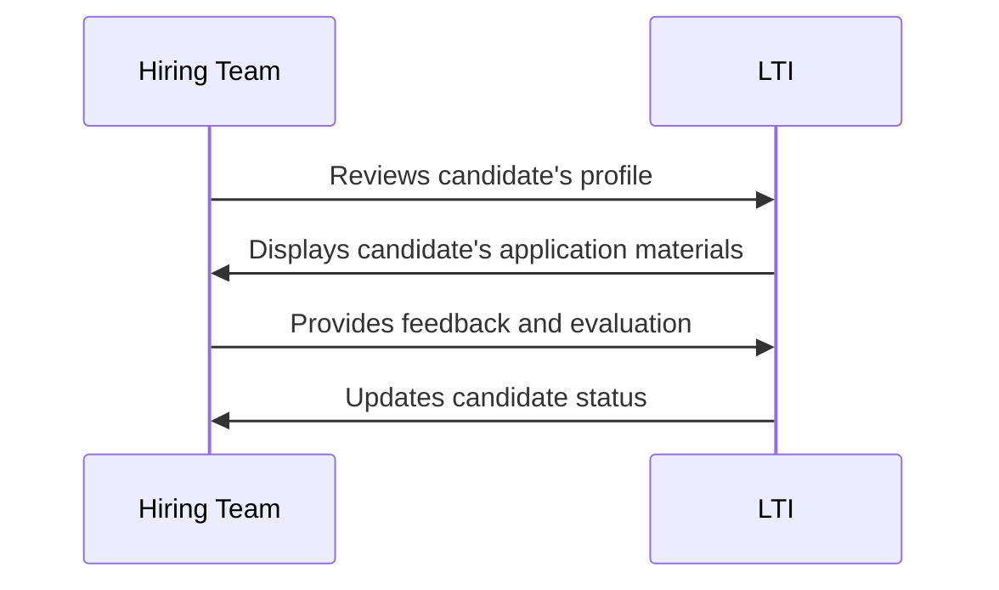
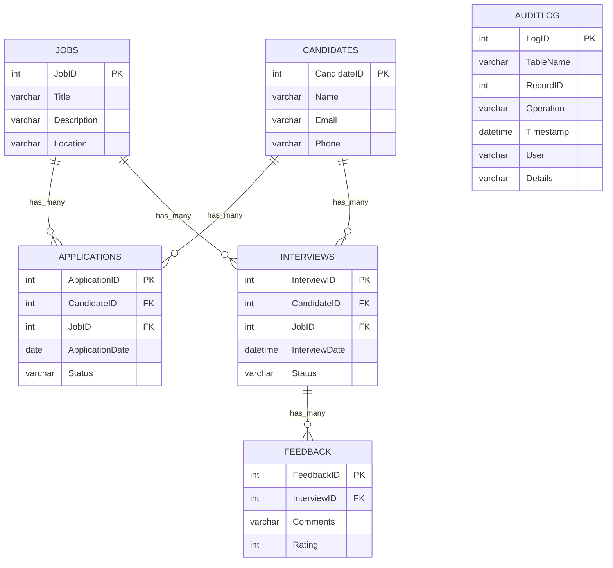
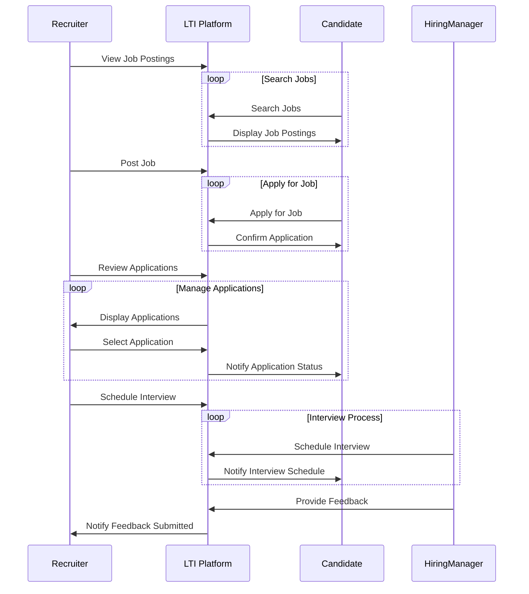
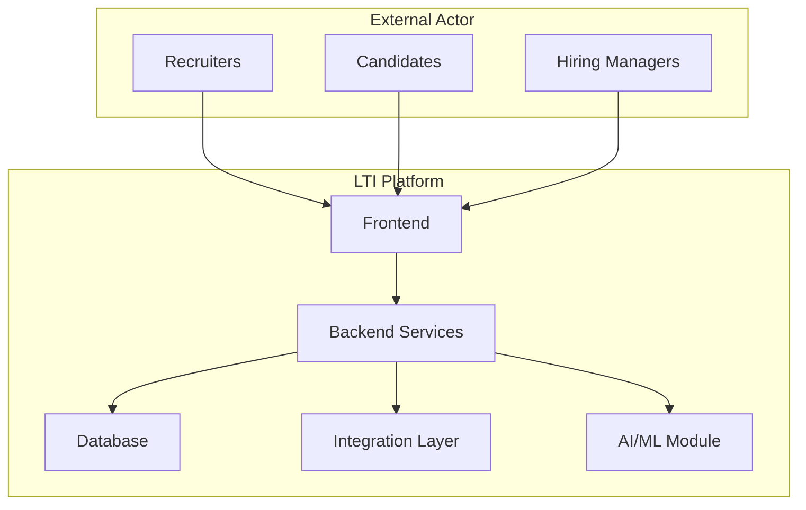
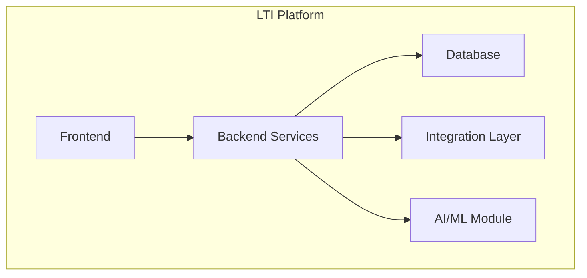
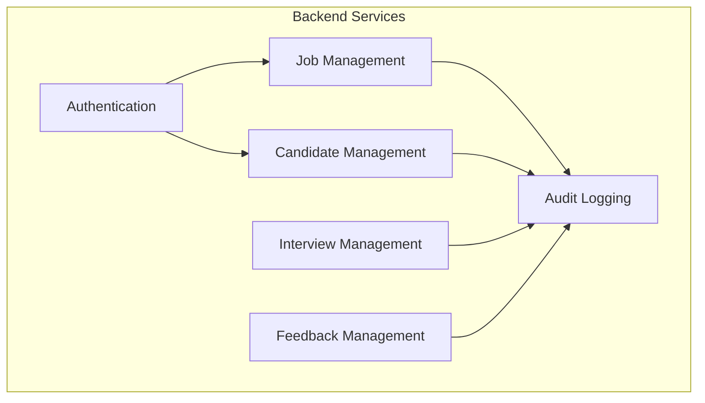

# LTI-FA

### 1. Explanation about the System:
LTI (Lean Tracking and Intelligence) is an Applicant Tracking System designed to streamline the recruitment process for organizations of all sizes. It provides a centralized platform for managing job postings, sourcing candidates, tracking applications, and collaborating with hiring teams. LTI aims to simplify the hiring process, reduce time-to-fill, and improve the quality of hires by leveraging intelligent features and automation.

### 2. Added Value:
- **Efficiency**: LTI automates repetitive tasks such as resume screening, interview scheduling, and candidate communication, freeing up recruiters to focus on strategic activities.
- **Insights**: By analyzing candidate data and recruitment metrics, LTI provides valuable insights into hiring trends, candidate performance, and recruitment effectiveness, enabling data-driven decision-making.
- **Customization**: LTI offers customizable workflows, templates, and communication tools, allowing organizations to tailor the system to their unique recruitment processes and branding requirements.

### 3. Competitive Advantage:
- **AI-Powered Candidate Matching**: LTI utilizes advanced AI algorithms to match candidates with job requirements based on skills, experience, and preferences, ensuring better fit and reducing time-to-hire.
- **Intuitive User Interface**: LTI features a user-friendly interface with intuitive navigation and actionable insights, enhancing user adoption and productivity.
- **Integration Capabilities**: LTI seamlessly integrates with third-party HR systems, job boards, and communication tools, providing a unified recruitment ecosystem and reducing data silos.

### 4. Principal Functions based on ATS Solutions:
1. **Job Posting Management**: Create, edit, and publish job postings across multiple channels.
2. **Candidate Sourcing**: Source candidates from various channels such as job boards, social networks, and employee referrals.
3. **Resume Parsing**: Automatically extract and parse candidate information from resumes into structured data fields.
4. **Candidate Tracking**: Track candidate progress throughout the recruitment lifecycle, from application submission to onboarding.
5. **Communication Tools**: Send personalized emails, SMS, and notifications to candidates and hiring teams.
6. **Interview Scheduling**: Schedule interviews, coordinate availability, and send reminders to candidates and interviewers.
7. **Collaboration**: Facilitate collaboration among hiring teams, allowing them to review, evaluate, and provide feedback on candidates.
8. **Reporting and Analytics**: Generate reports on recruitment metrics such as time-to-fill, source effectiveness, and candidate quality.

### 5. Diagram representative of the system:

This diagram illustrates the flow of key functions within the LTI platform, from job posting management to reporting and analytics, showcasing the interconnected nature of the system's components.

With LTI, organizations can optimize their recruitment processes, attract top talent, and make informed hiring decisions, ultimately driving business success.

## Main processes

Certainly! Here are three main use cases for the LTI platform, along with diagrams illustrating each scenario:

### 1. Candidate Application Process:
This use case outlines the process a candidate goes through when applying for a job through the LTI platform.

#### Diagram:

### 2. Interview Scheduling:
This use case illustrates how hiring managers schedule interviews with candidates using the LTI platform.

#### Diagram:

### 3. Candidate Evaluation and Feedback:
This use case demonstrates how hiring teams collaborate to evaluate candidates and provide feedback within the LTI platform.

#### Diagram:

These diagrams visually represent the flow of each use case within the LTI platform, showcasing the interactions between users and the system.

## Database Design

To design a relational database schema for the LTI platform and incorporate log tracking for the audit process, we'll consider the various entities and relationships involved in the system. Here's a simplified schema:

### Entities:
1. **Jobs**: Stores information about job postings.
   - JobID (Primary Key)
   - Title
   - Description
   - Location
   - ...
   
2. **Candidates**: Stores information about candidates.
   - CandidateID (Primary Key)
   - Name
   - Email
   - Phone
   - ...
   
3. **Applications**: Stores information about candidate applications.
   - ApplicationID (Primary Key)
   - CandidateID (Foreign Key)
   - JobID (Foreign Key)
   - ApplicationDate
   - Status
   - ...
   
4. **Interviews**: Stores information about scheduled interviews.
   - InterviewID (Primary Key)
   - CandidateID (Foreign Key)
   - JobID (Foreign Key)
   - InterviewDate
   - Status
   - ...
   
5. **Feedback**: Stores feedback provided by hiring teams.
   - FeedbackID (Primary Key)
   - InterviewID (Foreign Key)
   - Comments
   - Rating
   - ...
   
6. **AuditLog**: Stores audit trail for tracking changes made to the data.
   - LogID (Primary Key)
   - TableName
   - RecordID
   - Operation (Insert, Update, Delete)
   - Timestamp
   - User
   - Details
   - ...

### Relationships:
- Each Job can have multiple Applications.
- Each Candidate can have multiple Applications.
- Each Application belongs to one Candidate and one Job.
- Each Candidate can have multiple Interviews.
- Each Job can have multiple Interviews.
- Each Interview belongs to one Candidate and one Job.
- Each Interview can have multiple Feedback entries.
- Each Feedback entry belongs to one Interview.
- The AuditLog records changes made to various tables in the database.

### Schema Diagram:

This schema provides a foundation for storing and managing data related to job postings, candidates, applications, interviews, feedback, and audit logs within the LTI platform. The AuditLog table allows for tracking changes made to the data, providing transparency and accountability in the recruitment process.

# High Level Design

Sure, let's create a high-level design for the LTI platform and include a use case diagram as well.

### High-Level Design:

The high-level design outlines the main components and their interactions within the LTI platform.

1. **Frontend**: 
   - Provides a user interface for recruiters, candidates, and hiring managers to interact with the system.
   - Allows users to view job postings, submit applications, schedule interviews, and provide feedback.

2. **Backend Services**:
   - Handles business logic and data processing.
   - Manages user authentication, job posting management, candidate sourcing, application processing, interview scheduling, feedback collection, and audit logging.

3. **Database**:
   - Stores data related to job postings, candidates, applications, interviews, feedback, and audit logs.
   - Provides a structured and scalable storage solution for the platform.

4. **Integration Layer**:
   - Integrates with third-party services such as email providers, HR systems, and job boards.
   - Facilitates seamless data exchange and communication between the LTI platform and external systems.

5. **AI/ML Module** (Optional):
   - Provides AI-powered features such as candidate matching, resume parsing, sentiment analysis, and predictive analytics.
   - Enhances the recruitment process by automating repetitive tasks and providing actionable insights.

### Use Case Diagram:

The use case diagram illustrates the various interactions between actors and the system components in the LTI platform.

In this diagram:
- **Recruiters** can view job postings, post new jobs, review applications, schedule interviews, and provide feedback.
- **Candidates** can search for jobs, apply for positions, and view the status of their applications.
- **Hiring Managers** can review applications, schedule interviews, and provide feedback on candidates.

These use cases cover the main interactions between users and the LTI platform, facilitating the recruitment process effectively.

This high-level design and use case diagram provide a clear overview of the LTI platform's architecture and functionality. Let me know if you need further clarification or details!

# C4 Diagram

### Level 1: Context Diagram

The context diagram provides an overview of the system and its interactions with external actors.

### Level 2: Container Diagram

The container diagram focuses on the internal components and their interactions within the system.

### Level 3: Component Diagram

The component diagram provides further detail on the internal components of the system, their dependencies, and interactions.

### Level 4: Code Diagram

The code diagram delves into the internal structure of individual components, such as classes, modules, or functions.

This level is typically not represented in C4 diagrams but can be further explored in documentation or IDE tools.
