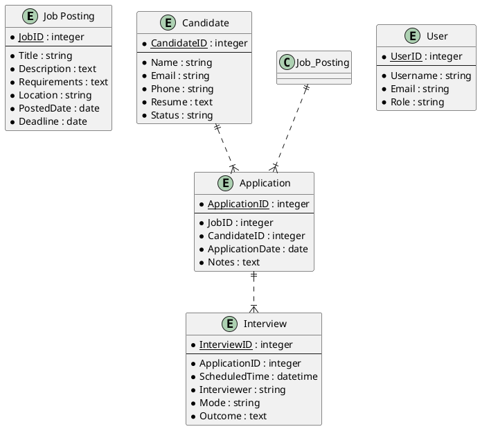
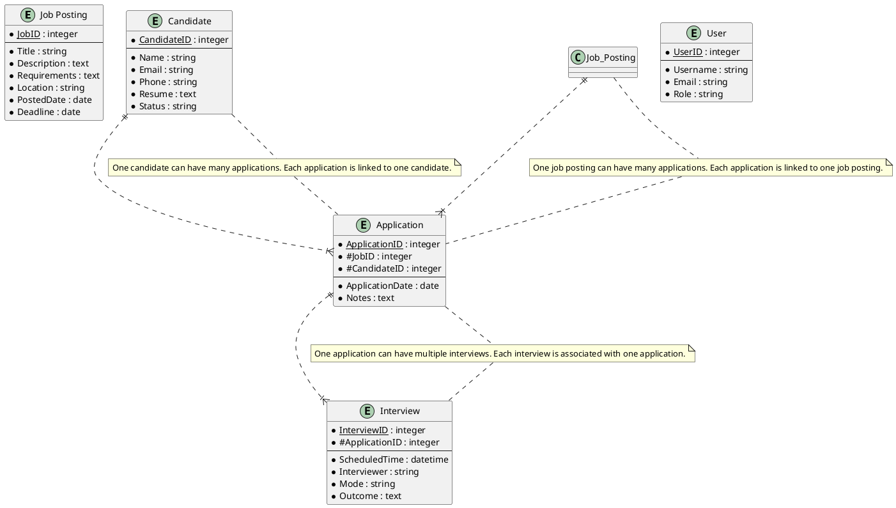

Person: 
- Generate diagrams for this system:

Data Model Development for LTI's Applicant Tracking System
For the data model, we need to define the entities involved in the ATS, their attributes, and the relationships between them. This model will be crucial for organizing and managing data effectively in the system. Here's an outline:

Entities and Their Attributes
Job Posting
JobID (integer, primary key)
Title (string)
Description (text)
Requirements (text)
Location (string)
PostedDate (date)
Deadline (date)
Candidate
CandidateID (integer, primary key)
Name (string)
Email (string)
Phone (string)
Resume (text) // Could link to a document or URL
Status (string, e.g., "New", "Screened", "Interviewed", "Offered", "Hired")
Application
ApplicationID (integer, primary key)
JobID (integer, foreign key)
CandidateID (integer, foreign key)
ApplicationDate (date)
Notes (text)
Interview
InterviewID (integer, primary key)
ApplicationID (integer, foreign key)
ScheduledTime (datetime)
Interviewer (string)
Mode (string, e.g., "In-person", "Remote")
Outcome (text)
User (HR or Hiring Manager)
UserID (integer, primary key)
Username (string)
Email (string)
Role (string, e.g., "HR", "Manager")
Relationships
Job Posting to Application
One job posting can have many applications, but each application is linked to one job posting.
Candidate to Application
One candidate can have many applications, but each application is linked to one candidate.
Application to Interview
One application can have multiple interviews (e.g., initial, technical, final), but each interview is associated with one application.

ChatGPT: 
- Ah, splendid! Let's conjure up a mystical Entity-Relationship diagram for the LTI's Applicant Tracking System using the mighty PlantUML! Here's a spell to visualize the data model based on the entities and relationships you've described:

This magical incantation will generate a diagram representing the entities and their connections: 
1. **Job Posting**  connects to **Application**  indicating that one job posting can have many applications. 
2. **Candidate**  connects to **Application**  showing that one candidate can apply to many jobs. 
3. **Application**  connects to **Interview**  highlighting that one application can have multiple interviews.

Prepare to invoke the powers of PlantUML to bring this diagram to life in your development environment! If you need further enchantments or wish to modify this arcane knowledge, just let me know!

Person: 
- Continue

ChatGPT: 
- Let us now delve deeper into the arcane connections and fortify our understanding of this mystic system by enhancing the diagram with additional details and summoning relationships:

In this extended version: 
- **Foreign keys**  are clearly defined, which enhances the relationships between entities. 
- **Notes**  are added to explain the relationships between entities in a magical yet comprehensible manner.

This more detailed map of the realm should aid you in navigating the complexities of your data model. Should you seek further enhancements or require specific aspects to be illuminated, do not hesitate to ask, for my wizardry is at your service!
