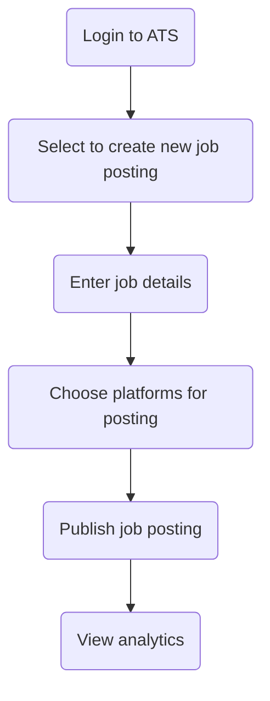
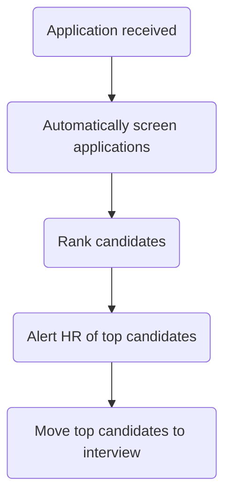
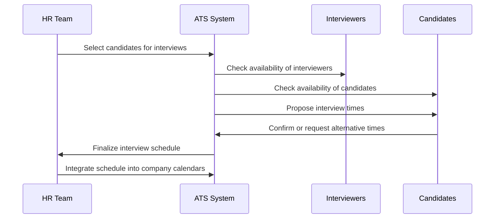
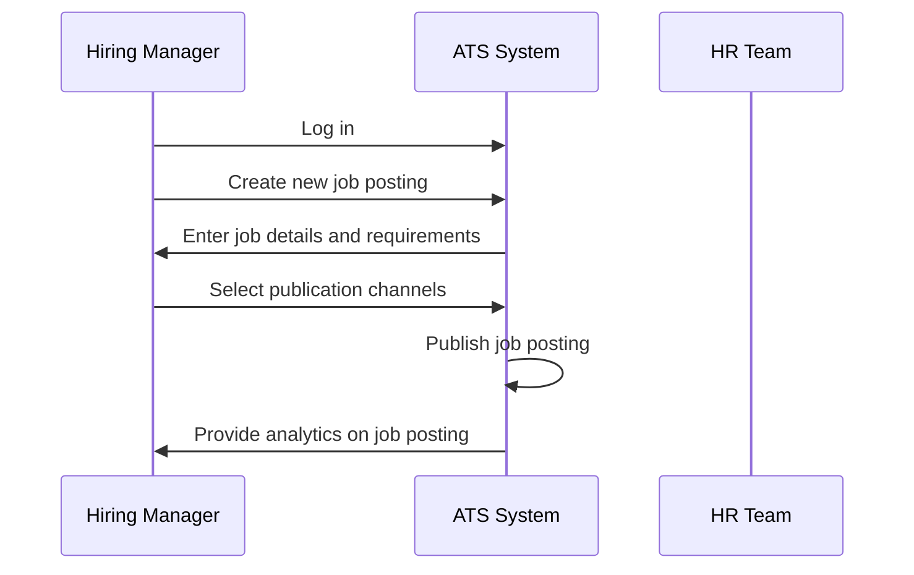
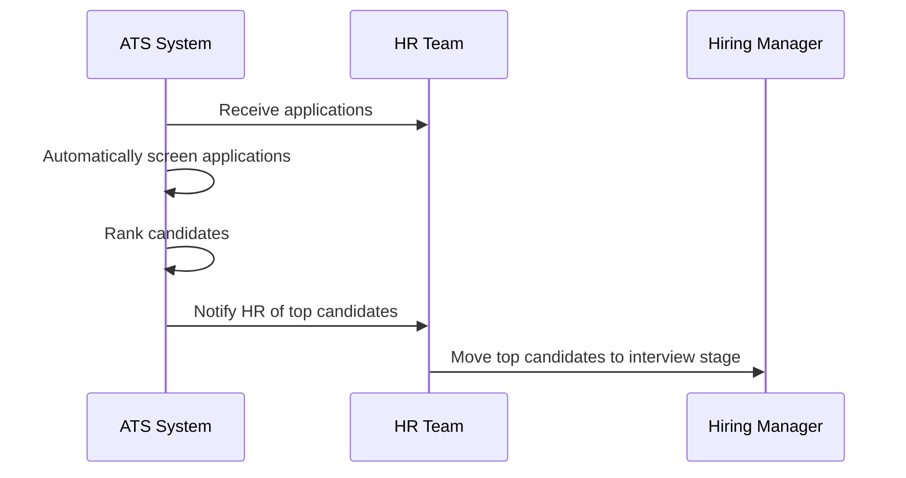

**Person:** 
- You have to create the most comprehensive diagrams for a system I will describe. A type of diagram is suggested, but you may suggest otherwise. There will be three diagrams. You will create one at a time and proceed to the next after my approval. So, only display the first one.

Description of the Three Main Use Cases for LTI's ATS
We'll now outline three primary use cases that illustrate how users interact with LTI's Applicant Tracking System. Each use case will include a diagram to visually represent the interactions.

Use Case 1: Job Posting Management
Description: The hiring manager needs to create and publish a job posting to multiple platforms directly from the ATS interface. The system allows the user to enter job details, set requirements, and choose publication channels. Once published, the ATS tracks the number of applications and provides analytics on the reach and effectiveness of the job posting.

Actors: Hiring managers, HR team members.

Main Steps:

Log into the ATS.
Select the option to create a new job posting.
Enter job details (title, description, requirements).
Choose where to publish the job (e.g., company career page, LinkedIn, job boards).
Publish the job posting.
View analytics on job posting effectiveness.
Diagram:
This would be a flowchart diagram showing the steps from creating a job posting to publishing and tracking its performance.

Use Case 2: Candidate Screening and Ranking
Description: Once candidates apply, the ATS automatically screens resumes based on predefined criteria such as skills, experience, and education. The system ranks candidates, making it easier for the hiring team to identify top candidates and move them to the interview stage.

Actors: HR team members, hiring managers.

Main Steps:

Receive applications submitted through various channels.
Automatically screen applications based on predefined criteria.
Rank candidates based on their match to the job requirements.
Notify HR team members of the top candidates.
Move top candidates to the interview stage.
Diagram:
A process diagram illustrating the screening and ranking workflow from application receipt to candidate shortlisting.

Use Case 3: Interview Scheduling
Description: The ATS integrates with calendar software to facilitate the scheduling of interviews. It automatically identifies available times for both interviewers and candidates and helps schedule interviews without the need for manual coordination.

Actors: Candidates, HR team members, interviewers.

Main Steps:

Select candidates for interviews.
Choose interviewers and review their availability.
Propose interview times to candidates based on mutual availability.
Candidates confirm or request alternative times.
Finalize interview schedule and notify all parties.
Integrate with company calendars.
Diagram:
A sequence diagram showing the interactions between the system, HR team members, interviewers, and candidates during the scheduling process.

Let's proceed with creating visual diagrams for each use case. I'll provide a brief outline of what each diagram should include based on the descriptions provided:

Diagram for Use Case 1: Job Posting Management
Start: User logs into the ATS.
Action: User selects the option to create a new job posting.
Input: User enters job details like title, description, and requirements.
Decision: Choose platforms for job posting.
Action: Publish the job posting.
Output: System tracks applications and provides analytics.
Type of Diagram: Flowchart.

Diagram for Use Case 2: Candidate Screening and Ranking
Start: Application is received.
Process: System automatically screens applications against criteria.
Evaluation: System ranks candidates based on match to job requirements.
Notification: System alerts HR team members of top candidates.
Action: HR moves top candidates to interview stage.
Type of Diagram: Process Diagram.

Diagram for Use Case 3: Interview Scheduling
Selection: HR selects candidates for interviews.
Availability Check: System checks availability of interviewers and candidates.
Proposal: System proposes times to candidates.
Confirmation: Candidates confirm or request changes.
Finalization: Interview schedule is finalized and integrated into calendars.
Type of Diagram: Sequence Diagram.

**ChatGPT:** 
- Talked to mermaidchart.com

Let's start by creating the flowchart for Use Case 1: Job Posting Management. This flowchart will visualize the sequence of actions a user performs to create, publish, and track a job posting within the Applicant Tracking System (ATS).

Here is an outline of the flowchart: 
1. **Start** : User logs into the ATS. 
2. **Action** : User selects the option to create a new job posting. 
3. **Input** : User enters job details like title, description, and requirements. 
4. **Decision** : Choose platforms for job posting. 
5. **Action** : Publish the job posting. 
6. **Output** : System tracks applications and provides analytics.

Now, I'll create this flowchart in Mermaid syntax and render it to ensure it's accurate.

Let's render this diagram and see how it looks.

Talked to mermaidchart.com

Here's the flowchart for Use Case 1: Job Posting Management in LTI's ATS. This diagram illustrates the process from login to viewing analytics of a job posting.

 

You can edit and save this diagram on the [MermaidChart editor](https://www.mermaidchart.com/app/mermaid-chart-save/2024-04-30/1e00c0aa-d63a-4d89-bbe7-87a146006baf) .

Please review this diagram, and let me know if it meets your expectations or if any adjustments are needed before we proceed to the next use case.

**Person:** 
- OK. Proceed.

**ChatGPT:** 
- Talked to mermaidchart.com

Now, let's proceed to create a flowchart for Use Case 2: Candidate Screening and Ranking. This flowchart will depict the process the ATS uses to screen and rank candidates based on predefined criteria.

Here is an outline of the flowchart for this use case: 
1. **Start** : Application is received. 
2. **Process** : System automatically screens applications against criteria. 
3. **Evaluation** : System ranks candidates based on match to job requirements. 
4. **Notification** : System alerts HR team members of top candidates. 
5. **Action** : HR moves top candidates to the interview stage.

Let's develop this diagram in Mermaid syntax and then render it to verify its accuracy.

I will now render this diagram to ensure it's correctly visualized.

Talked to mermaidchart.com

Here's the flowchart for Use Case 2: Candidate Screening and Ranking in LTI's ATS. This diagram visualizes the process from receiving applications to moving top candidates to the interview stage.

 

You can edit and save this diagram on the [MermaidChart editor](https://www.mermaidchart.com/app/mermaid-chart-save/2024-04-30/be34323a-cbc7-457e-a4e9-e0311c4b9f21) .

Please let me know if this meets your expectations or if any adjustments are needed before we proceed to the next use case.

**Person:** 
- Proceed.

**ChatGPT:** 
- Talked to mermaidchart.com

Let's now create the sequence diagram for Use Case 3: Interview Scheduling. This diagram will depict the interactions between the system, HR team members, interviewers, and candidates as they coordinate to schedule interviews.

Here is an outline of the sequence diagram for this use case: 
1. **HR selects candidates**  for interviews. 
2. **System checks availability**  of interviewers and candidates. 
3. **System proposes interview times**  to candidates based on mutual availability. 
4. **Candidates confirm**  or request alternative times. 
5. **Interview schedule is finalized**  and integrated into company calendars.

Here's the Mermaid syntax for the sequence diagram:

Let's render this diagram to visualize the interactions.

Talked to mermaidchart.com

Here's the sequence diagram for Use Case 3: Interview Scheduling in LTI's ATS. This diagram illustrates the sequence of interactions between the HR team, the ATS system, interviewers, and candidates to schedule interviews.

 

You can edit and save this diagram on the [MermaidChart editor](https://www.mermaidchart.com/app/mermaid-chart-save/2024-04-30/e945e0e6-88b6-403e-8f5e-fd2d964c293c) .

Please review this diagram and let me know if it meets your expectations or if any adjustments are needed. If everything looks good, this completes our series of diagrams for the use cases.

**Person:** 
- Generate sequence diagram for Use case #1 instead of flowchart.

**ChatGPT:** 
- Certainly! Let's create a sequence diagram for Use Case 1: Job Posting Management. This diagram will show the interactions between the hiring manager, HR team members, and the ATS system as they manage job postings.

Here’s how the interactions could be represented: 
1. **Hiring Manager logs into the ATS** . 
2. **Hiring Manager creates a new job posting** , entering details and requirements. 
3. **ATS processes the job details** . 
4. **Hiring Manager selects publication channels** . 
5. **ATS publishes the job posting**  on selected channels. 
6. **ATS tracks applications and provides analytics**  to the Hiring Manager.

Here's the Mermaid syntax for this sequence diagram:

Let's render this sequence diagram to visualize these interactions.

Talked to mermaidchart.com

Here's the sequence diagram for Use Case 1: Job Posting Management in LTI's ATS. This diagram illustrates the sequence of interactions involved in managing job postings, from logging in to viewing analytics.

 

You can edit and save this diagram on the [MermaidChart editor](https://www.mermaidchart.com/app/mermaid-chart-save/2024-04-30/f9ac7c90-df13-459b-8a11-a2b7f5960de1) .

Please review this sequence diagram and let me know if it meets your expectations or if any adjustments are needed.

**Person:** 
- DO the same for Use Case #2

**ChatGPT:** 
- For Use Case 2: Candidate Screening and Ranking, let’s construct a sequence diagram to represent the interactions between the HR team members, the ATS system, and the hiring manager as they process candidate applications.

Here’s an outline of the sequence diagram: 
1. **ATS receives applications**  from various channels. 
2. **ATS screens applications**  automatically based on predefined criteria. 
3. **ATS ranks candidates**  according to how well they match the job requirements. 
4. **ATS notifies HR team members**  of the top candidates. 
5. **HR team moves top candidates**  to the interview stage.

Here's the Mermaid syntax for this sequence diagram:

Now, I'll render this diagram to visualize the interactions.

Talked to mermaidchart.com

Here's the sequence diagram for Use Case 2: Candidate Screening and Ranking in LTI's ATS. This diagram visualizes the sequence of interactions from receiving applications to moving top candidates to the interview stage.

 

You can edit and save this diagram on the [MermaidChart editor](https://www.mermaidchart.com/app/mermaid-chart-save/2024-04-30/2f8a0dc5-c449-4ba4-a96b-5d9090bf070b) .

Please review this diagram and let me know if any adjustments are needed or if we can proceed with anything else.

**Person:** 
- DO the sequence diagram for Use Case #3

**ChatGPT:** 
- For Use Case 3: Interview Scheduling, we'll develop a sequence diagram to capture the interactions between HR team members, interviewers, candidates, and the ATS system as they coordinate to schedule interviews.

Here’s a detailed outline of the sequence diagram: 
1. **HR selects candidates for interviews.** 
2. **System checks availability of interviewers and candidates.** 
3. **System proposes interview times to candidates based on mutual availability.** 
4. **Candidates confirm or request alternative times.** 
5. **Interview schedule is finalized and integrated into company calendars.**

Here's the Mermaid syntax for this sequence diagram:

Now, let's render this diagram to ensure it accurately represents the sequence of actions for interview scheduling.

Talked to mermaidchart.com

Here's the sequence diagram for Use Case 3: Interview Scheduling in LTI's ATS. This diagram shows the interactions between the HR team, the ATS system, interviewers, and candidates as they coordinate to schedule interviews.

 

You can edit and save this diagram on the [MermaidChart editor](https://www.mermaidchart.com/app/mermaid-chart-save/2024-04-30/9acd85ce-b932-4639-908a-dedaa6809fe0) .

Please review this diagram and let me know if any changes are needed or if we can assist with anything else.
