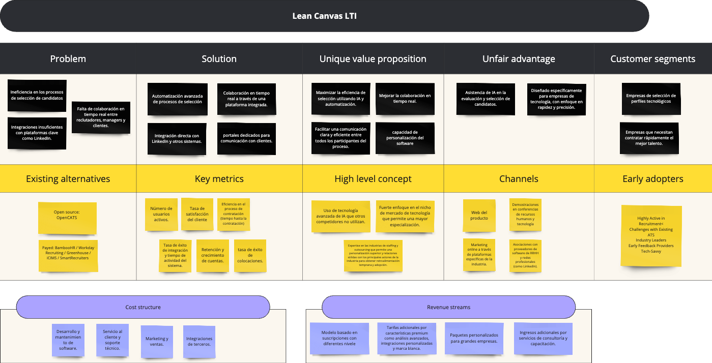
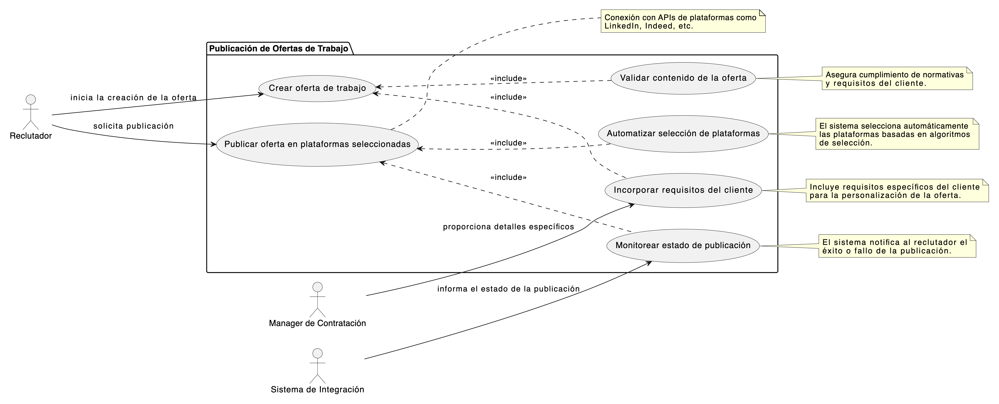
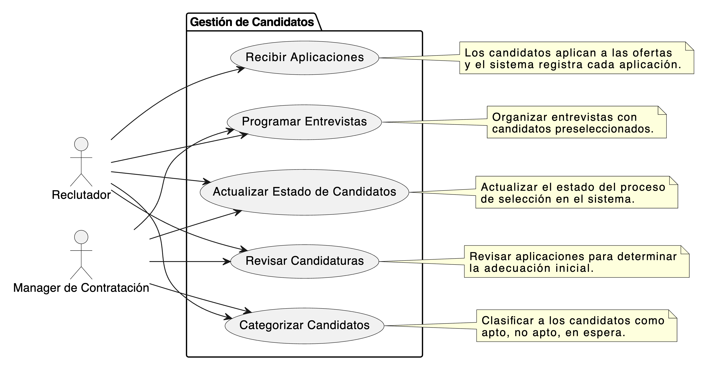
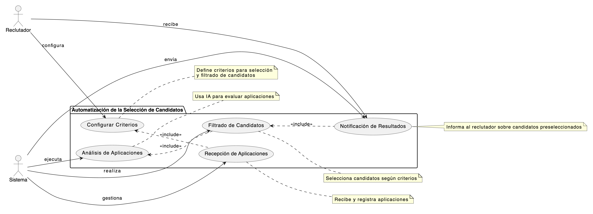
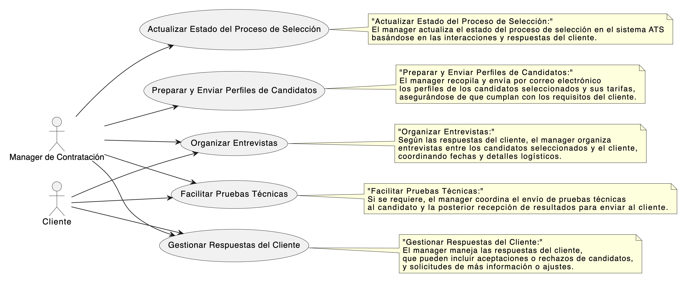
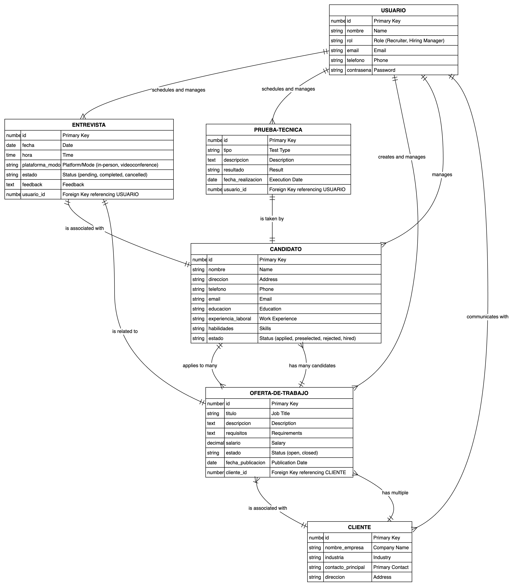

# Sistema de Gestión de Solicitantes (ATS) - Documento de Diseño

## Descripción del Software LTI:

LTI es un software de seguimiento de candidatos (ATS) diseñado específicamente para empresas de tecnología que buscan optimizar sus procesos de selección. Con herramientas avanzadas de automatización e inteligencia artificial, LTI aumenta significativamente la eficiencia de selección al permitir una colaboración en tiempo real entre reclutadores, managers y clientes.

La plataforma integra funcionalidades clave como la comunicación directa sobre el estado y tarifas de los candidatos, así como integraciones con plataformas como LinkedIn para maximizar la captación de talento.

LTI no solo agiliza los flujos de trabajo, sino que también proporciona insights estratégicos para mejorar la toma de decisiones en la contratación.

Target de clientes

Este producto pretende cubrir necesidades específicas en empresas que se dedican a seleccionar perfiles para empresas de tecnología. Estas empresas suelen tener altos volúmenes de reclutamiento y necesidades específicas de gestión de talento debido a la naturaleza de sus proyectos y la diversidad de sus clientes.

 Áreas clave donde el software LTI puede ser especialmente valioso 

1. **Eficiencia en el Proceso de Selección**
   - **Automatización:** Automatizar tareas repetitivas como el filtrado de CVs, la evaluación inicial de candidatos, y la programación de entrevistas, lo que puede significar un ahorro considerable de tiempo.
   - **Mejora en la gestión de candidatos:** Permitiendo una visión más estructurada y ordenada de los candidatos en proceso, facilitando su seguimiento y evaluación.

2. **Colaboración en Tiempo Real**
   - **Comunicación interna:** Facilita la colaboración en tiempo real entre reclutadores y managers de contratación, permitiendo discusiones internas y notas sobre candidatos sin salir de la plataforma.
   - **Interfaz colaborativa:** Posibilita que varios miembros del equipo trabajen juntos en la selección de candidatos y en la toma de decisiones, lo cual es crucial en empresas grandes con varios stakeholders en el proceso de contratación.

3. **Relaciones con Clientes**
   - **Canal de comunicación con clientes:** Ofrece un canal eficiente para que los managers de contratación puedan comunicarse con los clientes sobre el estado de los candidatos, incluyendo información detallada sobre tarifas y disponibilidad.
   - **Reportes y transparencia:** Genera reportes sobre el progreso del reclutamiento y el rendimiento del proceso de selección que pueden ser compartidos directamente con los clientes, aumentando la transparencia y fortaleciendo la relación de confianza.

4. **Integraciones y Automatizaciones**
   - **Integración con plataformas externas:** Como LinkedIn y otros portales de empleo, lo que permite a los reclutadores obtener y sincronizar información directamente desde estas plataformas.
   - **Automatizaciones inteligentes:** Uso de inteligencia artificial para automatizar la clasificación de candidatos, la predicción de ajustes de roles y la identificación de candidatos potenciales a través de análisis avanzados.

5. **Asistencia de Inteligencia Artificial**
   - **Mejora en la selección:** Utilización de IA para analizar el encaje cultural y las habilidades técnicas de los candidatos, proporcionando recomendaciones basadas en datos para las decisiones de contratación.
   - **Procesamiento de lenguaje natural:** Para analizar las descripciones de los trabajos y las aplicaciones de los candidatos, identificando las mejores coincidencias basadas en criterios más allá de las palabras clave.

 Analisis competidores 

### Sistemas ATS de Código Abierto

| Sistema ATS  | Descripción                                                                                                   | Características Principales                                                                        | Puntos Fuertes                                    | Limitaciones                                                        | Enlace Web                              |
|--------------|--------------------------------------------------------------------------------------------------------------|----------------------------------------------------------------------------------------------------|--------------------------------------------------|----------------------------------------------------------------------|-----------------------------------------|
| OpenCATS     | Un ATS de código abierto diseñado para pequeñas y medianas empresas.                                         | Gestión de candidatos, informes básicos, integración con correos.                                  | Gratuito y personalizable.                        | Requiere conocimientos técnicos para instalación y mantenimiento.   | [OpenCATS](http://www.opencats.org)     |
| BreezyHR     | Sistema ATS basado en la nube para simplificar el proceso de contratación.                                   | Publicación en múltiples plataformas de empleo, parsing de CV, integración de correo.              | Fácil de usar, integración con más de 50 tableros de trabajo. | Limitado a un empleo activo en el plan gratuito.                 | [BreezyHR](http://www.breezy.hr)        |
| iKrut        | Un ATS gratuito que ofrece una amplia gama de funcionalidades.                                               | Gestión ilimitada de ofertas de trabajo, integración con redes sociales, herramientas de informes. | Sin límite de ofertas de trabajo, soporte de email y teléfono. | Interfaz menos moderna.                                           | [iKrut](http://www.ikrut.com)           |
| Freshteam    | Un ATS parte de Freshworks, diseñado para automatizar el proceso de contratación.                            | Integración de correo electrónico, seguimiento de candidatos, paneles de información.              | Gratis hasta 50 empleados, fácil de usar.        | No incluye parsing de CV en el plan gratuito.                     | [Freshteam](http://www.freshworks.com)  |
| Jobsoid      | Un sistema ATS diseñado para simplificar la contratación mediante la automatización de tareas.               | Publicación de trabajos con un clic, sitio de carreras de marca, aplicaciones móviles.             | Ideal para startups y pequeñas empresas.          | Funcionalidades limitadas en el plan gratuito.                    | [Jobsoid](http://www.jobsoid.com)       |

### Sistemas ATS de Pago

| Sistema ATS     | Descripción                                                                                                   | Características Principales                                                             | Puntos Fuertes                                    | Limitaciones                                                         | Enlace Web                                |
|-----------------|--------------------------------------------------------------------------------------------------------------|-----------------------------------------------------------------------------------------|--------------------------------------------------|----------------------------------------------------------------------|-------------------------------------------|
| Greenhouse      | Greenhouse es un ATS robusto conocido por sus capacidades de informes y optimización del proceso de contratación. | Análisis de datos, integración con múltiples plataformas, herramientas de colaboración. | Alto grado de personalización, excelente para grandes volúmenes de contratación. | Puede ser costoso para empresas más pequeñas.                      | [Greenhouse](https://www.greenhouse.io)   |
| Lever           | Lever proporciona un ATS combinado con CRM para mejorar la relación con los candidatos durante el proceso de contratación. | Gestión de candidatos, integración de CRM, informes avanzados.                          | Interfaz intuitiva, excelente para la colaboración en equipo.       | Alto costo comparado con otros sistemas.                           | [Lever](https://www.lever.co)             |
| Workday         | Workday ofrece un sistema de gestión de recursos humanos que incluye capacidades de ATS para empresas de gran tamaño. | Gestión del talento, análisis predictivo, integraciones con HRIS.                       | Integración con HRIS, bueno para empresas grandes. | Complejidad y costo pueden ser barreras para pequeñas empresas.     | [Workday](https://www.workday.com)        |
| SmartRecruiters | Un ATS diseñado para proporcionar una experiencia de contratación de extremo a extremo.                        | Integración de marketing de reclutamiento, gestión de candidatos, colaboración en equipo. | Fácil de usar, amplias integraciones.            | Puede ser menos personalizable que otros sistemas.                  | [SmartRecruiters](https://www.smartrecruiters.com) |
| iCIMS           | iCIMS se centra en ayudar a las empresas a atraer y contratar a los mejores talentos de manera eficiente.       | Herramientas de adquisición de talento, integraciones con plataformas de terceros, analítica. | Robusto y escalable, excelente soporte al cliente. | Más adecuado para empresas grandes debido a su costo.               | [iCIMS](https://www.icims.com)            |

 Lean Canvas 

## Añadimos 3 casos de uso principales

 Casos uso más importantes

   1. Publicación de Ofertas de Trabajo
   Descripción: Permitir a los reclutadores crear y publicar ofertas de trabajo en múltiples plataformas (como LinkedIn, portales de empleo y redes sociales) desde un solo lugar.
   Beneficios: Simplifica el proceso de publicación y asegura una amplia visibilidad de las vacantes.
   2. Gestión de Candidatos
   Descripción: Facilitar la gestión y seguimiento de todos los candidatos desde la aplicación hasta la contratación o rechazo, incluyendo la categorización y filtrado por habilidades, experiencia y más.
   Beneficios: Mejora la organización de los candidatos y ayuda a seleccionar los más adecuados de manera eficiente.
   3. Automatización de la Selección de Candidatos
   Descripción: Utilizar inteligencia artificial para analizar currículums y perfiles, automatizando la preselección de candidatos basada en criterios predefinidos.
   Beneficios: Reduce la carga de trabajo manual y aumenta la precisión en la selección inicial, acelerando el proceso de contratación.
   4. Integraciones con Plataformas Externas
   Descripción: Integrar el sistema con plataformas externas como LinkedIn, sistemas de gestión de recursos humanos (HRIS) y otras herramientas empresariales.
   Beneficios: Permite una sincronización de datos sin fisuras y una operatividad más fluida, evitando la duplicidad de esfuerzos y errores.
   5. Colaboración en Tiempo Real
   Descripción: Proporcionar una plataforma que permita la comunicación y colaboración en tiempo real entre reclutadores, managers de contratación y clientes.
   Beneficios: Facilita la toma de decisiones rápida y mejora la transparencia en el proceso de contratación.
   6. Informes y Análisis de Datos
   Descripción: Ofrecer herramientas de reporting y análisis para evaluar la eficacia de las campañas de reclutamiento y la gestión del talento.
   Beneficios: Proporciona insights valiosos para la mejora continua y la toma de decisiones basada en datos.
   7. Onboarding de Candidatos
   Descripción: Automatizar el proceso de incorporación de nuevos empleados con la generación de documentos necesarios, programación de sesiones de inducción y más.
   Beneficios: Asegura una transición suave para los nuevos empleados y reduce la carga administrativa del departamento de recursos humanos.
   8. Seguridad y Cumplimiento de Datos
   Descripción: Implementar fuertes medidas de seguridad para proteger la información sensible de candidatos y cumplir con regulaciones como GDPR.
   Beneficios: Protege contra violaciones de datos y evita sanciones legales, manteniendo la confianza de los usuarios.
   9. Personalización y Configuración de Flujos de Trabajo
   Descripción: Permitir a los usuarios personalizar flujos de trabajo y procesos de contratación según las necesidades específicas de la empresa.
   Beneficios: Ofrece flexibilidad y adaptabilidad, mejorando la eficiencia operativa de acuerdo con las políticas internas de la empresa.

Publicación de Ofertas de Trabajo

## Descripción del Diagrama

### Actores:
**_Reclutador_**: Prepara y ejecuta la creación de ofertas de trabajo.
**_Manager de Contratación_**: Proporciona detalles específicos sobre los requisitos del cliente para asegurar que la oferta de trabajo atraiga a los candidatos adecuados.
_**Sistema de Integración**_: Automatiza la selección de plataformas y monitoriza el estado de la publicación.
_**Reclutador y Manager de Contratación**_:
El reclutador consulta al manager de contratación para entender mejor las necesidades específicas del cliente y recibir información detallada que debe incluirse en la oferta de trabajo.
El manager de contratación proporciona esta información específica que se incorpora en la oferta de trabajo para asegurar que atraiga a los candidatos adecuados.
_**Reclutador y Sistema de Integración**_:
El reclutador inicia la creación de la oferta y verifica su contenido a través del sistema para asegurar que cumpla con las normativas y expectativas.
El sistema automatiza la selección de plataformas de publicación basándose en criterios preestablecidos y controla el estado de la publicación, informando al reclutador sobre el éxito o fallos potenciales.

### Casos de Uso:
_**Crear oferta de trabajo**_: El reclutador redacta la oferta de trabajo, detallando aspectos generales del puesto.
**_Automatizar selección de plataformas_**: El sistema elige automáticamente las plataformas más adecuadas para la publicación basándose en criterios preestablecidos.
_**Validar contenido de la oferta**_: Se realiza una verificación para asegurar que el contenido cumple con los estándares y normativas requeridas.
_**Incorporar requisitos del cliente**_: El manager de contratación añade información específica requerida por el cliente para personalizar la oferta de trabajo.
_**Publicar oferta en plataformas seleccionadas**_: La oferta se publica en las plataformas seleccionadas automáticamente, mediante integración con sus APIs.
_**Monitorear estado de publicación**_: El sistema proporciona actualizaciones sobre el éxito o fallo de la publicación.

 Gestion Candidatos 

## Descripción del Diagrama

### Actores:
- **Reclutador**: Responsable de manejar las aplicaciones, revisar candidatos, categorizarlos, programar entrevistas y actualizar sus estados en el sistema.
- **Manager de Contratación**: Interactúa con el sistema para revisar y validar las decisiones tomadas por los reclutadores y asegurar que se siguen los procedimientos adecuados.

### Casos de Uso:
- **Recibir Aplicaciones**: Capta y registra las aplicaciones de los candidatos de manera automática cuando estos aplican a las ofertas.
- **Revisar Candidaturas**: Implica una revisión inicial para determinar si los candidatos cumplen con los criterios básicos del puesto.
- **Categorizar Candidatos**: Los candidatos son clasificados en categorías como apto, no apto, o en espera, basado en la evaluación inicial y detallada.
- **Programar Entrevistas**: Involucra la organización de entrevistas con los candidatos que han sido clasificados como aptos.
- **Actualizar Estado de Candidatos**: Actualiza la información en el sistema sobre el progreso de cada candidato en el proceso de selección.

Automatización de la Selección de Candidatos

# Automatización de la Selección de Candidatos

## Explicación del Diagrama

### Actores:
- **Reclutador**: Interactúa con el sistema para configurar los criterios de selección y recibir notificaciones sobre los candidatos seleccionados.
- **Sistema**: Realiza las tareas automatizadas de recepción, análisis y filtrado de aplicaciones, así como la notificación de resultados.

### Casos de Uso:
- **Configurar Criterios**: El reclutador establece los parámetros bajo los cuales los candidatos serán evaluados.
- **Recepción de Aplicaciones**: El sistema recoge todas las aplicaciones enviadas.
- **Análisis de Aplicaciones**: Las aplicaciones son analizadas automáticamente utilizando inteligencia artificial para evaluar cómo cada candidato cumple con los criterios.
- **Filtrado de Candidatos**: Los candidatos que cumplen con los criterios son seleccionados.
- **Notificación de Resultados**: El sistema notifica al reclutador sobre los candidatos preseleccionados.

### Relaciones de Inclusión:
Estas relaciones indican que la ejecución de un caso de uso depende de la finalización de otro, resaltando el flujo necesario y secuencial del proceso de selección automatizado.

comunicacion manager con cliente

## Modelo de datos

## Disseño del sistema

# Sistema ATS Innovador - Documentación de Arquitectura

## Descripción General

El Sistema ATS Innovador está diseñado para optimizar el proceso de reclutamiento mediante una arquitectura de microservicios. Este sistema facilita el desarrollo, despliegue y mantenimiento de sus componentes, asegurando la escalabilidad y la flexibilidad para adaptarse a diferentes entornos y necesidades.

## Arquitectura del Sistema

### Diagrama de Contexto (Nivel 1)

El diagrama de contexto muestra cómo el sistema ATS interactúa con usuarios y sistemas externos:

Componentes:
- **Sistema ATS**: El sistema principal.
- **Usuarios**: Diferentes roles como reclutadores, candidatos, y gerentes de contratación.
- **Sistemas Externos**: Plataformas de Redes Sociales, Portales de Empleo, Sistemas de Verificación de Antecedentes, Plataformas de Evaluación de Habilidades, Sistemas de Gestión de Recursos Humanos (HRMS).

### Paso 2: Diagrama de Contenedores (Nivel 2)

El sistema se descompone en varios contenedores que incluyen:

Componentes:

- **Frontend Web**:  Interfaz de usuario para interactuar con el sistema.**
- **API Gateway**
- **Servidor de Aplicaciones**: Maneja la lógica de negocio, interactúa con la base de datos y servicios externos.
- **Bases de Datos de Candidatos y Ofertas de Empleo: Almacena datos del usuario, candidatos, ofertas de trabajo, etc**

 Diagrama 3: Diagrama de Componentes (Nivel 3)

**Componentes de Gestión de Candidatos**: Administra datos y procesos relacionados con los candidatos.
**Componentes de Gestión de Entrevistas:** Coordina la programación y el seguimiento de entrevistas.
**Componentes de Notificaciones**: Envía actualizaciones y comunicaciones a los usuarios.

Diagrama C4 - Nivel 4 del "Business Service"

**Clases de Gestión de Candidatos**: Implementa la lógica para operaciones CRUD.
**Clases de Notificación**: Maneja la creación y envío de mensajes a los usuarios.
**Interfaces de Servicios Externos**: Define cómo el sistema interactúa con APIs externas.

**Notification Manager**: Se encarga de enviar notificaciones automáticas a los candidatos y a los reclutadores sobre el estatus del proceso de reclutamiento y otras alertas importantes.
**Candidate Manager**: Administra todas las operaciones de los datos de los candidatos, incluyendo la creación, actualización y eliminación de registros de candidatos.
**Job Offer Manager**: Gestiona la creación y actualización de ofertas de empleo, asegurando que los detalles estén actualizados y correctamente publicados en los tableros de empleo externos.
**Interview Manager**: Coordina la programación de entrevistas, asegurando que los candidatos y los reclutadores tengan la información necesaria para encuentros efectivos.
**External Systems Integration**: Integra el sistema ATS con tableros de empleo externos y sistemas de recursos humanos para facilitar una sincronización fluida de datos y operaciones.
**AI Analytics**: Utiliza algoritmos de aprendizaje automático y análisis predictivo para mejorar la selección de candidatos, ofreciendo recomendaciones basadas en la compatibilidad con las descripciones de trabajo.

## Diagramas Mermaid

### Diagrama C4

