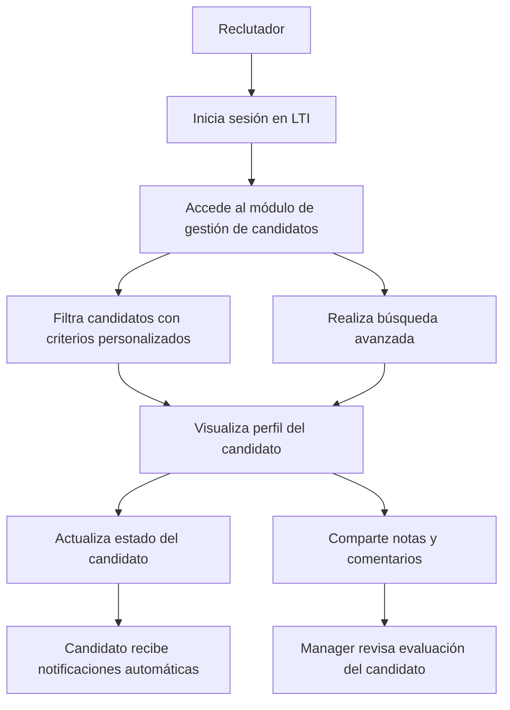
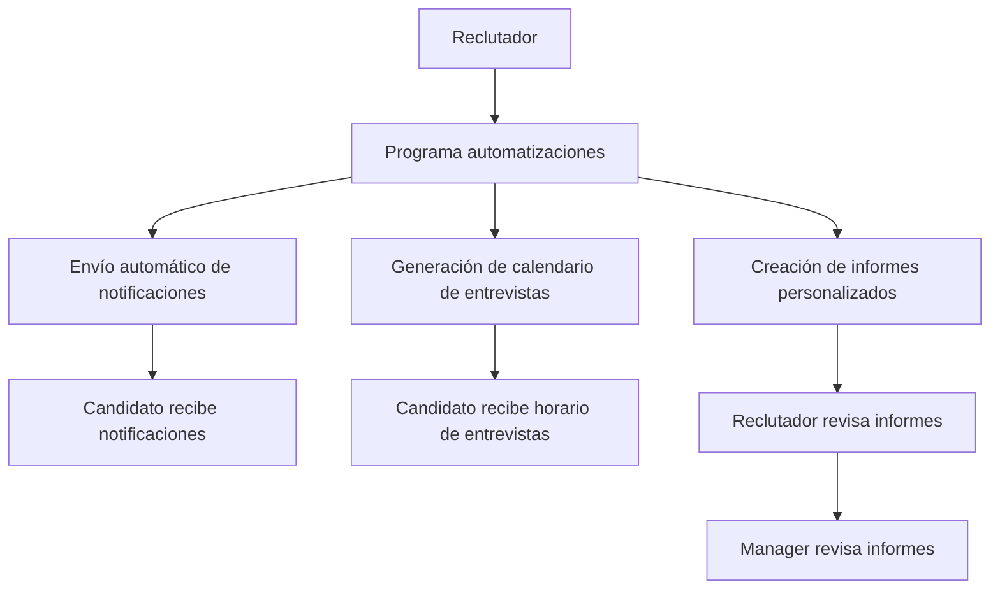
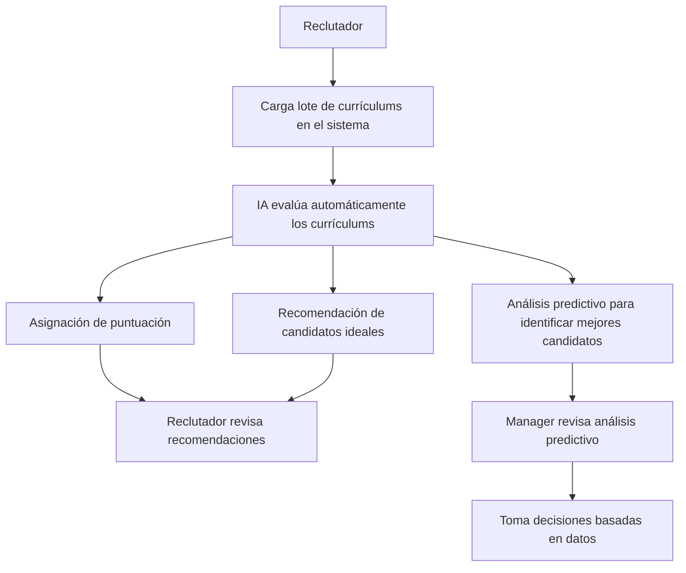
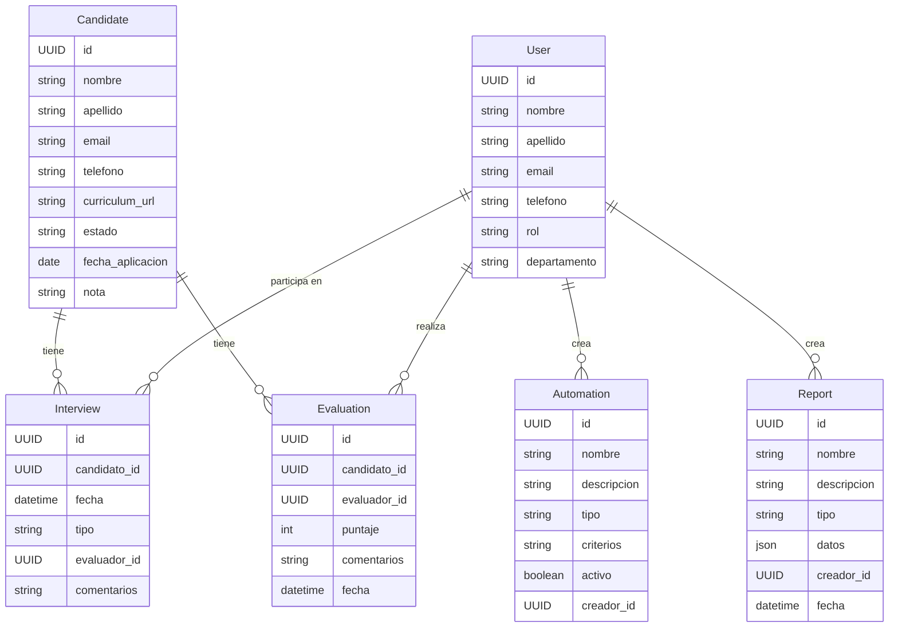
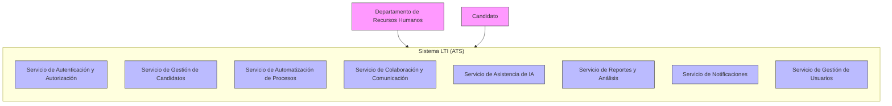
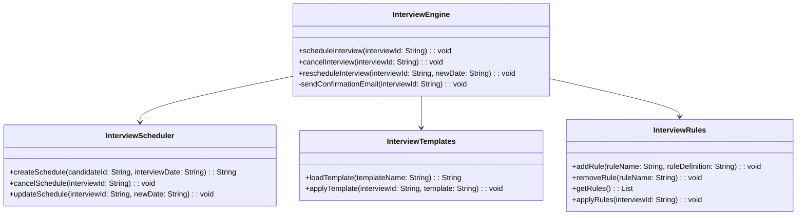

# Ejercicio de Sesión 4

Contenido completo publicado en Notion: <https://mpizarrocuevas.notion.site/Proyecto-LTI-e7ef38ba5346489cad67f0d316ea8c51>

---

## Planificación y documentación efectivas con IA (Parte 1) - ✍️ Diseño de un sistema de gestión de candidatos

## **Descripción Breve del Software LTI**

**LTI** es una startup innovadora que busca revolucionar el mercado de los ATS (Applicant-Tracking System) creando una plataforma que ofrece una experiencia optimizada tanto para reclutadores como para candidatos. LTI se enfoca en mejorar la eficiencia de los departamentos de Recursos Humanos, facilitando la colaboración en tiempo real entre reclutadores y managers, y ofreciendo automatizaciones inteligentes con ayuda de IA.

### **Valor Añadido y Ventajas Competitivas**

- **Colaboración en Tiempo Real:** Permite a reclutadores y managers trabajar juntos de forma eficiente, compartiendo comentarios, evaluaciones y actualizaciones instantáneamente.
- **Integraciones Flexibles:** Compatibilidad con otras herramientas populares de gestión de talento para una experiencia integrada.

- **Automatizaciones Inteligentes:** Reducción significativa de tareas administrativas mediante la automatización de procesos repetitivos (filtrado de candidatos, seguimiento de solicitudes, notificaciones automatizadas, etc.).
- **Personalización Avanzada:** Paneles de control, reportes y notificaciones personalizables que se adaptan a las necesidades específicas de cada organización.

- **Asistencia de IA:** Herramientas de inteligencia artificial que ofrecen insights sobre los candidatos, recomendaciones de candidatos ideales, evaluaciones de habilidades, análisis predictivo, y más.

### **Funciones Principales**

**Gestión de Candidatos:**

- Base de datos centralizada de candidatos.
- Filtrado inteligente y búsqueda avanzada.
- Seguimiento del ciclo de vida del candidato.

**Asistencia de IA:**

- Evaluación automática de currículums.
- Recomendación de candidatos ideales.
- Análisis predictivo para identificar mejores candidatos.

**Colaboración y Comunicación:**

- Herramientas de comunicación integradas para el equipo de reclutamiento.
- Evaluaciones y comentarios compartidos.
- Panel de control colaborativo.

**Integraciones Externas:**

- Integración con LinkedIn, portales de empleo y otras plataformas de recursos humanos.
- API abierta para conectar con otras herramientas.

**Automatización de Procesos:**

- Notificaciones automáticas a candidatos.
- Programación de entrevistas automatizada.
- Creación de informes personalizados.

**Reportes y Análisis:**

- Análisis detallado de métricas clave.
- Paneles de control personalizables.
- Reportes de diversidad, inclusión y tendencias de contratación.

### **Lean Canvas de LTI**

<aside>
⚠️ **Problemas**

Identifica los problemas clave que enfrenta el segmento de clientes.

- Procesos de contratación ineficientes
- Falta de colaboración entre reclutadores y managers
- Tareas manuales repetitivas
</aside>

<aside>
💪🏻 **Ventaja Injusta**

Explica qué hace que LTI sea difícil de replicar.

- Colaboración en tiempo real
- Integraciones flexibles
- Personalización avanzada
</aside>

<aside>
📣 **Canales**

Enumera los métodos para llegar a los clientes.

- Ventas directas
- Asociaciones estratégicas
- Marketing online
</aside>

<aside>
✅ **Soluciones**

Describe cómo LTI planea resolver esos problemas.

- Herramientas de colaboración en tiempo real
- Automatización inteligente
- Reclutamiento asistido por IA
</aside>

<aside>
👥 **Segmentos de Clientes**

Define los grupos principales de clientes a los que se dirige.

- Departamentos de RR.HH.
- Agencias de reclutamiento
- Managers corporativos de contratación
</aside>

<aside>
💸 **Estructura de Costos**

Enumera los principales costos asociados con el negocio.

- Desarrollo
- Marketing
- Soporte al cliente
</aside>

<aside>
🔝 **Propuesta de Valor Única**

Resalta los factores diferenciadores de LTI frente a la competencia.

- Mayor eficiencia
- Mejor colaboración
- Automatizaciones inteligentes
- Asistencia de IA
</aside>

<aside>
📊 **Métricas Clave**

Identifica las métricas críticas para medir el éxito de LTI.

- Tiempo de contratación
- Puntuación de calidad de candidatos
- Eficiencia en colaboración
</aside>

<aside>
🤑 **Fuentes de Ingresos**

Enumera las formas en que LTI genera ingresos.

- Precio basado en suscripción
- Integraciones personalizadas
- Soporte premium
</aside>

### Caso de Uso 1: Gestión de Candidatos

**Descripción:** Este caso de uso permite a los reclutadores gestionar la base de datos centralizada de candidatos, realizar búsquedas avanzadas y filtrar candidatos, además de llevar un seguimiento completo del ciclo de vida del candidato.

**Actores:** Reclutador, Manager, Candidato

**Flujo Principal:**

1. El reclutador inicia sesión en LTI.
2. Accede al módulo de gestión de candidatos.
3. Filtra candidatos con criterios personalizados o realiza búsquedas avanzadas.
4. Visualiza el perfil del candidato y actualiza su estado.
5. Comparte notas y comentarios con el equipo.
6. El manager revisa la evaluación del candidato.
7. El candidato recibe notificaciones automáticas sobre el estado de su solicitud.

### Caso de Uso 2: Automatización de Procesos

**Descripción:** Este caso de uso automatiza tareas repetitivas, como el envío de notificaciones automáticas a candidatos, programación automatizada de entrevistas y la creación de informes personalizados.

**Actores:** Reclutador, Manager, Candidato

**Flujo Principal:**

1. El reclutador programa una serie de automatizaciones.
2. El sistema envía notificaciones automáticas a los candidatos.
3. Se genera un calendario automático para las entrevistas.
4. Se crean informes personalizados para evaluar la eficacia de las automatizaciones.

### Caso de Uso 3: Asistencia de IA

**Descripción:** Este caso de uso permite a los reclutadores aprovechar la inteligencia artificial para evaluar automáticamente currículums, obtener recomendaciones de candidatos ideales y realizar análisis predictivos para identificar a los mejores candidatos.

**Actores:** Reclutador, Manager

**Flujo Principal:**

1. El reclutador carga un lote de currículums en el sistema.
2. La IA evalúa automáticamente los currículums y asigna una puntuación.
3. La IA proporciona recomendaciones de candidatos ideales.
4. La IA realiza un análisis predictivo para identificar a los mejores candidatos.
5. El reclutador revisa las recomendaciones y resultados del análisis.
6. El manager revisa el análisis predictivo y toma decisiones basadas en datos.

```mermaid
flowchart TD
    A[Reclutador] --> B[Carga lote de currículums en el sistema]
    B --> C[IA evalúa automáticamente los currículums]
    C --> D[Asignación de puntuación]
    C --> E[Recomendación de candidatos ideales]
    C --> F[Análisis predictivo para identificar mejores candidatos]
    D --> G[Reclutador revisa recomendaciones]
    E --> G
    F --> H[Manager revisa análisis predictivo]
    H --> I[Toma decisiones basadas en datos]

```

### Modelo de Datos

**Usuario (User):**

- **id** (UUID): Identificador único del usuario.
- **nombre** (string): Nombre del usuario.
- **apellido** (string): Apellido del usuario.
- **email** (string): Email del usuario.
- **telefono** (string): Teléfono del usuario.
- **rol** (string): Rol del usuario (ej. "Reclutador", "Manager", "Admin").
- **departamento** (string): Departamento al que pertenece el usuario (opcional).

**Candidato (Candidate):**

- **id** (UUID): Identificador único del candidato.
- **nombre** (string): Nombre del candidato.
- **apellido** (string): Apellido del candidato.
- **email** (string): Email del candidato.
- **telefono** (string): Teléfono del candidato.
- **curriculum_url** (string): URL del currículum.
- **estado** (string): Estado actual del candidato (ej. "Aplicando", "Entrevistado", "Contratado").
- **fecha_aplicacion** (date): Fecha de aplicación del candidato.
- **nota** (string): Comentarios adicionales sobre el candidato.

**Reporte (Report):**

- **id** (UUID): Identificador único del reporte.
- **nombre** (string): Nombre del reporte.
- **descripcion** (string): Descripción del reporte.
- **tipo** (string): Tipo de reporte (ej. "Diversidad", "Inclusion", "Contratación").
- **datos** (json): Datos generados por el reporte.
- **creador_id** (UUID): Referencia al reclutador que creó el reporte.
- **fecha** (datetime): Fecha de creación del reporte.

**Entrevista (Interview):**

- **id** (UUID): Identificador único de la entrevista.
- **candidato_id** (UUID): Referencia al candidato.
- **fecha** (datetime): Fecha y hora de la entrevista.
- **tipo** (string): Tipo de entrevista (ej. "Teléfono", "Presencial", "Videollamada").
- **evaluador_id** (UUID): Referencia al evaluador (Reclutador o Manager).
- **comentarios** (string): Comentarios del evaluador sobre la entrevista.

**Evaluacion (Evaluation):**

- **id** (UUID): Identificador único de la evaluación.
- **candidato_id** (UUID): Referencia al candidato.
- **evaluador_id** (UUID): Referencia al evaluador (Reclutador o Manager).
- **puntaje** (int): Puntaje asignado al candidato.
- **comentarios** (string): Comentarios adicionales sobre la evaluación.
- **fecha** (datetime): Fecha de la evaluación.

**Automatizacion (Automation):**

- **id** (UUID): Identificador único de la automatización.
- **nombre** (string): Nombre de la automatización.
- **descripcion** (string): Descripción de la automatización.
- **tipo** (string): Tipo de automatización (ej. "Notificación", "Entrevista").
- **criterios** (string): Criterios utilizados para la automatización.
- **activo** (boolean): Indica si la automatización está activa o no.
- **creador_id** (UUID): Referencia al reclutador que creó la automatización.

### Diagrama Entidad-Relación

### Detalle de las relaciones

- **User a Interview:** Un usuario (Reclutador o Manager) puede participar en múltiples entrevistas.
- **User a Evaluation:** Un usuario puede realizar múltiples evaluaciones.
- **User a Automation:** Un usuario puede crear múltiples automatizaciones.
- **User a Report:** Un usuario puede crear múltiples reportes.
- **Candidate a Interview:** Un candidato puede tener múltiples entrevistas.
- **Candidate a Evaluation:** Un candidato puede tener múltiples evaluaciones.

### Arquitectura de Alto nivel con DDD

### Dominios Principales y Subdominios

**Gestión de Candidatos:**

- Subdominios:
    - Gestión de Candidatos (Candidate Management)
    - Evaluaciones (Evaluations)
    - Entrevistas (Interviews)

**Automatización de Procesos:**

- Subdominios:
    - Automatización de Notificaciones (Notification Automation)
    - Automatización de Entrevistas (Interview Scheduling Automation)

**Colaboración y Comunicación:**

- Subdominios:
    - Comunicación Interna (Internal Communication)
    - Paneles de Control Colaborativos (Collaborative Dashboards)

**Asistencia de IA:**

- Subdominios:
    - Evaluación de Currículums (Resume Evaluation)
    - Recomendación de Candidatos (Candidate Recommendations)
    - Análisis Predictivo (Predictive Analysis)

**Reportes y Análisis:**

- Subdominios:
    - Reportes Personalizados (Custom Reports)
    - Métricas Clave (Key Metrics)
    - Análisis de Diversidad e Inclusión (Diversity and Inclusion Analysis)

### Bounded Contexts

**BC Gestión de Candidatos:**

- Subdominios:
    - Gestión de Candidatos (Candidate Management)
    - Evaluaciones (Evaluations)
    - Entrevistas (Interviews)

**BC Automatización de Procesos:**

- Subdominios:
    - Automatización de Notificaciones (Notification Automation)
    - Automatización de Entrevistas (Interview Scheduling Automation)

**BC Colaboración y Comunicación:**

- Subdominios:
    - Comunicación Interna (Internal Communication)
    - Paneles de Control Colaborativos (Collaborative Dashboards)

**BC Asistencia de IA:**

- Subdominios:
    - Evaluación de Currículums (Resume Evaluation)
    - Recomendación de Candidatos (Candidate Recommendations)
    - Análisis Predictivo (Predictive Analysis)

**BC Reportes y Análisis:**

- Subdominios:
    - Reportes Personalizados (Custom Reports)
    - Métricas Clave (Key Metrics)
    - Análisis de Diversidad e Inclusión (Diversity and Inclusion Analysis)

**BC Usuarios y Autorización:**

- Subdominios:
    - Gestión de Usuarios (User Management)
    - Autorización y Roles (Authorization and Roles)

### Descripción de los Bounded Contexts

**Gestión de Candidatos (Candidate Management Context):**

- **Servicios:**
    - **Candidate Service:** Gestiona las operaciones CRUD de candidatos.
    - **Interview Service:** Gestiona la programación de entrevistas.
    - **Evaluation Service:** Gestiona evaluaciones de candidatos.
- **Base de Datos:**
    - **Candidate Database:** Almacena datos de candidatos.
    - **Interview Database:** Almacena datos de entrevistas.
    - **Evaluation Database:** Almacena datos de evaluaciones.

**Automatización de Procesos (Process Automation Context):**

- **Servicios:**
    - **Notification Automation Service:** Automatiza el envío de notificaciones.
    - **Interview Automation Service:** Automatiza la programación de entrevistas.
- **Base de Datos:**
    - **Notification Automation Database:** Almacena reglas de automatización de notificaciones.
    - **Interview Automation Database:** Almacena reglas de automatización de entrevistas.

**Colaboración y Comunicación (Collaboration and Communication Context):**

- **Servicios:**
    - **Internal Communication Service:** Gestiona la comunicación interna entre usuarios.
    - **Collaborative Dashboards Service:** Proporciona paneles de control colaborativos.
- **Base de Datos:**
    - **Internal Communication Database:** Almacena mensajes internos.
    - **Collaborative Dashboards Database:** Almacena datos de los paneles colaborativos.

**Asistencia de IA (AI Assistance Context):**

- **Servicios:**
    - **Resume Evaluation Service:** Evalúa automáticamente currículums.
    - **Candidate Recommendations Service:** Proporciona recomendaciones de candidatos.
    - **Predictive Analysis Service:** Realiza análisis predictivos.
- **Base de Datos:**
    - **Resume Evaluation Database:** Almacena datos de evaluación de currículums.
    - **Candidate Recommendations Database:** Almacena recomendaciones generadas.
    - **Predictive Analysis Database:** Almacena resultados de análisis predictivos.

**Reportes y Análisis (Reports and Analysis Context):**

- **Servicios:**
    - **Custom Reports Service:** Genera reportes personalizados.
    - **Key Metrics Service:** Proporciona métricas clave de rendimiento.
    - **Diversity & Inclusion Analysis Service:** Realiza análisis de diversidad e inclusión.
- **Base de Datos:**
    - **Custom Reports Database:** Almacena datos de reportes personalizados.
    - **Key Metrics Database:** Almacena métricas clave.
    - **Diversity & Inclusion Analysis Database:** Almacena datos de análisis de diversidad.

**Usuarios y Autorización (Users and Authorization Context):**

- **Servicios:**
    - **Auth Service:** Gestiona autenticación y autorización.
    - **User Service:** Gestiona datos de usuarios y roles.
- **Base de Datos:**
    - **User Database:** Almacena datos de usuarios.

```mermaid
flowchart TB
    subgraph API_Gateway[API Gateway]
        direction TB
        AuthService["Auth Service"]:::service
        UserService["User Service"]:::service
        CandidateService["Candidate Service"]:::service
        InterviewService["Interview Service"]:::service
        EvaluationService["Evaluation Service"]:::service
        NotificationAutomationService["Notification Automation Service"]:::service
        InterviewAutomationService["Interview Automation Service"]:::service
        InternalCommunicationService["Internal Communication Service"]:::service
        CollaborativeDashboardsService["Collaborative Dashboards Service"]:::service
        ResumeEvaluationService["Resume Evaluation Service"]:::service
        CandidateRecommendationsService["Candidate Recommendations Service"]:::service
        PredictiveAnalysisService["Predictive Analysis Service"]:::service
        CustomReportsService["Custom Reports Service"]:::service
        KeyMetricsService["Key Metrics Service"]:::service
        DiversityInclusionService["Diversity & Inclusion Analysis Service"]:::service
        NotificationService["Notification Service"]:::service
    end

    subgraph Database[Database Centralizada]
        UserDB[(User Database)]:::database
        CandidateDB[(Candidate Database)]:::database
        InterviewDB[(Interview Database)]:::database
        EvaluationDB[(Evaluation Database)]:::database
        NotificationAutomationDB[(Notification Automation Database)]:::database
        InterviewAutomationDB[(Interview Automation Database)]:::database
        InternalCommunicationDB[(Internal Communication Database)]:::database
        CollaborativeDashboardsDB[(Collaborative Dashboards Database)]:::database
        ResumeEvaluationDB[(Resume Evaluation Database)]:::database
        CandidateRecommendationsDB[(Candidate Recommendations Database)]:::database
        PredictiveAnalysisDB[(Predictive Analysis Database)]:::database
        CustomReportsDB[(Custom Reports Database)]:::database
        KeyMetricsDB[(Key Metrics Database)]:::database
        DiversityInclusionDB[(Diversity & Inclusion Analysis Database)]:::database
    end

    AuthService --> UserDB
    UserService --> UserDB
    CandidateService --> CandidateDB
    InterviewService --> InterviewDB
    EvaluationService --> EvaluationDB
    NotificationAutomationService --> NotificationAutomationDB
    InterviewAutomationService --> InterviewAutomationDB
    InternalCommunicationService --> InternalCommunicationDB
    CollaborativeDashboardsService --> CollaborativeDashboardsDB
    ResumeEvaluationService --> ResumeEvaluationDB
    CandidateRecommendationsService --> CandidateRecommendationsDB
    PredictiveAnalysisService --> PredictiveAnalysisDB
    CustomReportsService --> CustomReportsDB
    KeyMetricsService --> KeyMetricsDB
    DiversityInclusionService --> DiversityInclusionDB
    NotificationService --> CandidateDB

    classDef service fill:#f9f,stroke:#333,stroke-width:1px
    classDef database fill:#bbf,stroke:#333,stroke-width:1px

```

### Diagrama C4

**Nivel 1: Diagrama de Contexto**

**Nivel 2: Diagrama de Contenedores**

```mermaid
flowchart TB
    subgraph LTI_ATS["Sistema LTI (ATS)"]
        direction TB
        API_Gateway["API Gateway"]:::container
        AuthService["Auth Service"]:::container
        UserService["User Service"]:::container
        CandidateService["Candidate Service"]:::container
        InterviewService["Interview Service"]:::container
        EvaluationService["Evaluation Service"]:::container
        NotificationAutomationService["Notification Automation Service"]:::container
        InterviewAutomationService["Interview Automation Service"]:::container
        InternalCommunicationService["Internal Communication Service"]:::container
        CollaborativeDashboardsService["Collaborative Dashboards Service"]:::container
        ResumeEvaluationService["Resume Evaluation Service"]:::container
        CandidateRecommendationsService["Candidate Recommendations Service"]:::container
        PredictiveAnalysisService["Predictive Analysis Service"]:::container
        CustomReportsService["Custom Reports Service"]:::container
        KeyMetricsService["Key Metrics Service"]:::container
        DiversityInclusionService["Diversity & Inclusion Analysis Service"]:::container
        NotificationService["Notification Service"]:::container
    end

    subgraph Database[Database Centralizada]
        UserDB[(User Database)]:::database
        CandidateDB[(Candidate Database)]:::database
        InterviewDB[(Interview Database)]:::database
        EvaluationDB[(Evaluation Database)]:::database
        NotificationAutomationDB[(Notification Automation Database)]:::database
        InterviewAutomationDB[(Interview Automation Database)]:::database
        InternalCommunicationDB[(Internal Communication Database)]:::database
        CollaborativeDashboardsDB[(Collaborative Dashboards Database)]:::database
        ResumeEvaluationDB[(Resume Evaluation Database)]:::database
        CandidateRecommendationsDB[(Candidate Recommendations Database)]:::database
        PredictiveAnalysisDB[(Predictive Analysis Database)]:::database
        CustomReportsDB[(Custom Reports Database)]:::database
        KeyMetricsDB[(Key Metrics Database)]:::database
        DiversityInclusionDB[(Diversity & Inclusion Analysis Database)]:::database
    end

    API_Gateway --> AuthService
    API_Gateway --> UserService
    API_Gateway --> CandidateService
    API_Gateway --> InterviewService
    API_Gateway --> EvaluationService
    API_Gateway --> NotificationAutomationService
    API_Gateway --> InterviewAutomationService
    API_Gateway --> InternalCommunicationService
    API_Gateway --> CollaborativeDashboardsService
    API_Gateway --> ResumeEvaluationService
    API_Gateway --> CandidateRecommendationsService
    API_Gateway --> PredictiveAnalysisService
    API_Gateway --> CustomReportsService
    API_Gateway --> KeyMetricsService
    API_Gateway --> DiversityInclusionService
    API_Gateway --> NotificationService

    AuthService --> UserDB
    UserService --> UserDB
    CandidateService --> CandidateDB
    InterviewService --> InterviewDB
    EvaluationService --> EvaluationDB
    NotificationAutomationService --> NotificationAutomationDB
    InterviewAutomationService --> InterviewAutomationDB
    InternalCommunicationService --> InternalCommunicationDB
    CollaborativeDashboardsService --> CollaborativeDashboardsDB
    ResumeEvaluationService --> ResumeEvaluationDB
    CandidateRecommendationsService --> CandidateRecommendationsDB
    PredictiveAnalysisService --> PredictiveAnalysisDB
    CustomReportsService --> CustomReportsDB
    KeyMetricsService --> KeyMetricsDB
    DiversityInclusionService --> DiversityInclusionDB
    NotificationService --> CandidateDB

    classDef container fill:#bbf,stroke:#333,stroke-width:1px
    classDef database fill:#bdf,stroke:#333,stroke-width:1px

```

**Nivel 3: Diagrama de Componentes para Automatización**

```mermaid
flowchart TB
    subgraph ProcessAutomation["Servicio de Automatización de Procesos"]
        direction TB
        NotificationAutomationService["Notification Automation Service"]:::service
        InterviewAutomationService["Interview Automation Service"]:::service

        subgraph NotificationComponents["Componentes de Notification Automation"]
            NotificationRules["Notification Rules Component"]:::component
            NotificationScheduler["Notification Scheduler Component"]:::component
            NotificationTemplates["Notification Templates Component"]:::component
            NotificationEngine["Notification Engine Component"]:::component
        end

        subgraph InterviewComponents["Componentes de Interview Automation"]
            InterviewRules["Interview Rules Component"]:::component
            InterviewScheduler["Interview Scheduler Component"]:::component
            InterviewTemplates["Interview Templates Component"]:::component
            InterviewEngine["Interview Engine Component"]:::component
        end
    end

    NotificationRules --> NotificationScheduler
    NotificationScheduler --> NotificationTemplates
    NotificationScheduler --> NotificationEngine

    InterviewRules --> InterviewScheduler
    InterviewScheduler --> InterviewTemplates
    InterviewScheduler --> InterviewEngine

    classDef service fill:#bbf,stroke:#333,stroke-width:1px
    classDef component fill:#bdf,stroke:#333,stroke-width:1px

```

**Nivel 4: Diagrama de Código para el Motor de Entrevistas**

**InterviewEngine:**

- **`scheduleInterview`**: Programa una entrevista para el candidato.
- **`cancelInterview`**: Cancela una entrevista existente.
- **`rescheduleInterview`**: Reprograma una entrevista.
- **`sendConfirmationEmail`**: Envía un email de confirmación para la entrevista.

**InterviewScheduler:**

- **`createSchedule`**: Crea una nueva programación para una entrevista.
- **`cancelSchedule`**: Cancela una programación existente.
- **`updateSchedule`**: Actualiza una programación existente.

**InterviewTemplates:**

- **`loadTemplate`**: Carga una plantilla específica de entrevistas.
- **`applyTemplate`**: Aplica una plantilla a una entrevista.

**InterviewRules:**

- **`addRule`**: Añade una nueva regla para la programación de entrevistas.
- **`removeRule`**: Elimina una regla existente.
- **`getRules`**: Devuelve una lista de todas las reglas.
- **`applyRules`**: Aplica todas las reglas a una entrevista específica.

---