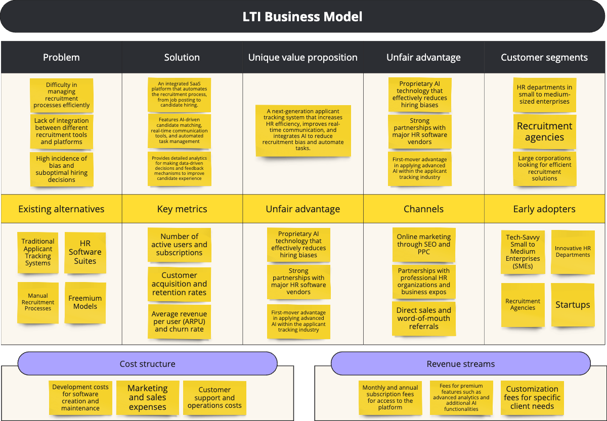

# LTI
> Revolutionize Recruitment with Bias-Free Candidate Matching and Efficient Applicant Tracking

# Brief Description of LTI Platform

LTI’s SaaS platform is designed to transform the recruitment process by providing a next-generation applicant tracking system. It aims to increase the efficiency of HR departments, improve real-time communication between recruiters and hiring managers, and integrate advanced AI to automate tasks and reduce biases in hiring. The platform supports a variety of tasks related to recruiting candidates for any position, making it a versatile tool for any organization looking to optimize their hiring process.

# Value Added by the Platform

1. **Enhanced Recruitment Efficiency**: Automation of routine tasks such as candidate screening and communications significantly reduces the workload on HR, allowing them to focus on strategic aspects of recruitment.
1. **Improved Quality of Hires**: By leveraging advanced AI algorithms, the platform ensures a higher accuracy in matching candidates to job requirements, which enhances the quality of hires and reduces biases.
1. **Cost Reduction**: Automating various aspects of the recruitment process helps companies save on operational costs, with reduced reliance on external recruitment agencies and fewer resources spent on lengthy recruitment processes.

# Competitive Advantages of Using the Platform

1. **Advanced AI Integration**: LTI's platform uses sophisticated AI to enhance the accuracy of candidate matching and to actively reduce biases, offering a smarter and fairer hiring process compared to traditional systems.
1. **Real-Time Collaboration Tools**: Unique features that enable immediate communication and decision-making among HR teams and hiring managers, improving the speed and effectiveness of the recruitment process.
1. **Seamless Integration**: The platform’s ability to integrate effortlessly with existing HR systems and tools ensures easy adoption and enhances its value by working within established workflows.

# LTI Business Model



# Main use cases 

## Automated Candidate Screening and Ranking

```
@startuml
!define RECTANGLE stereotype rectangle
!define ELLIPSE stereotype ellipse

left to right direction
skinparam packageStyle rectangle

actor Recruiter
actor "Hiring Manager" as HiringManager

rectangle "Automated Candidate Screening and Ranking" {
  usecase "Import Resumes" as ImportResumes
  usecase "Parse Resumes" as ParseResumes
  usecase "Match Qualifications" as MatchQualifications
  usecase "Rank Candidates" as RankCandidates
  usecase "Notify Recruiters" as NotifyRecruiters

  Recruiter --> ImportResumes : uploads
  Recruiter --> NotifyRecruiters : receives notifications
  HiringManager --> RankCandidates : reviews and approves
  
  ImportResumes .right.> ParseResumes : feeds into
  ParseResumes .right.> MatchQualifications : feeds into
  MatchQualifications .right.> RankCandidates : results in
  RankCandidates .right.> NotifyRecruiters : triggers
}

@enduml
```
